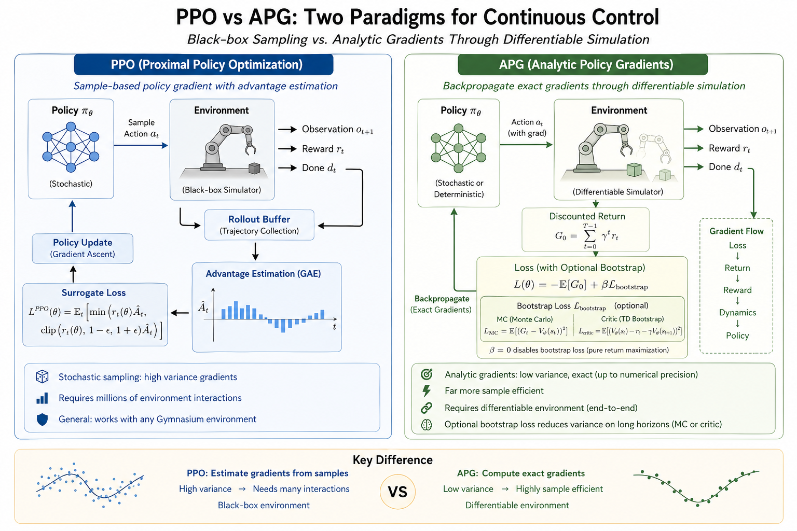
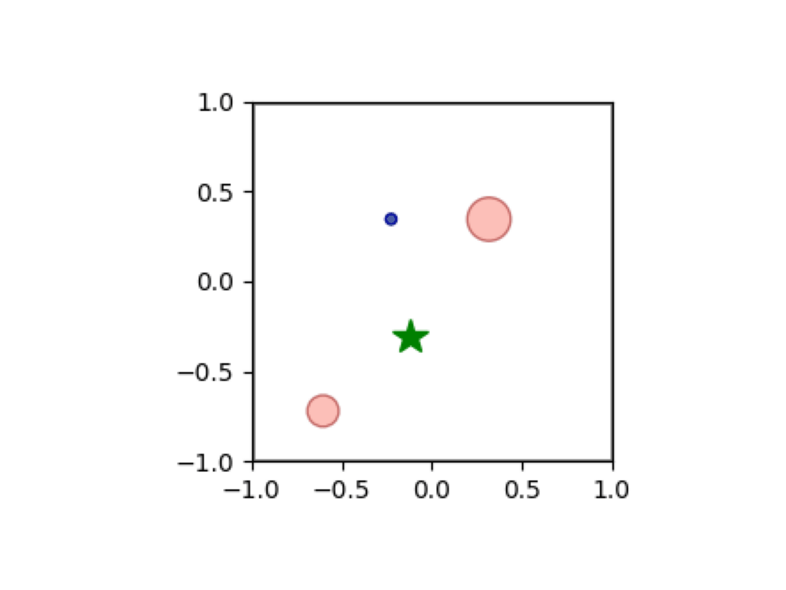
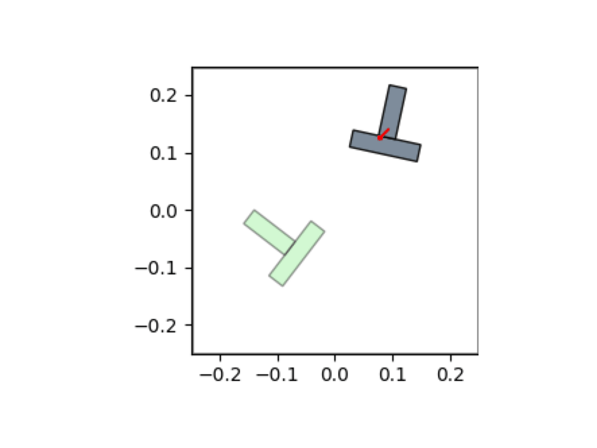
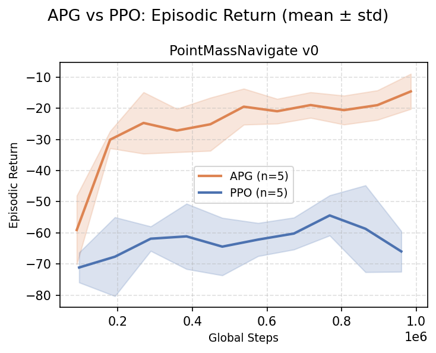
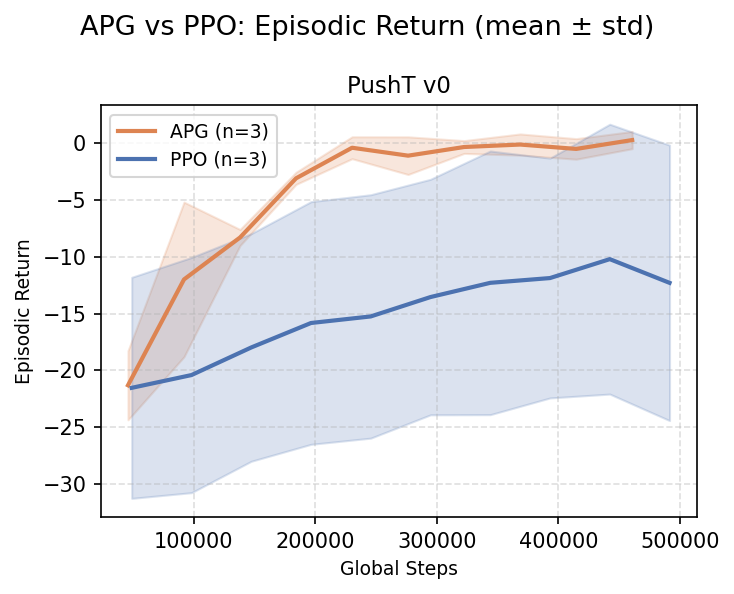
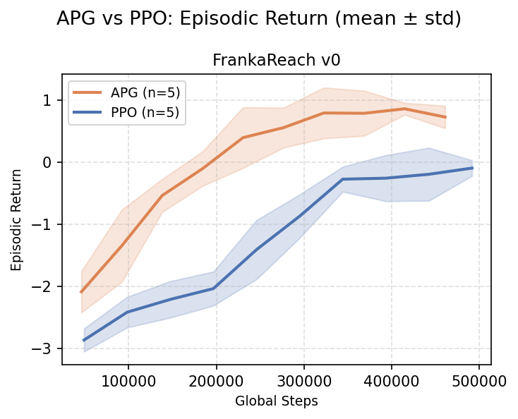
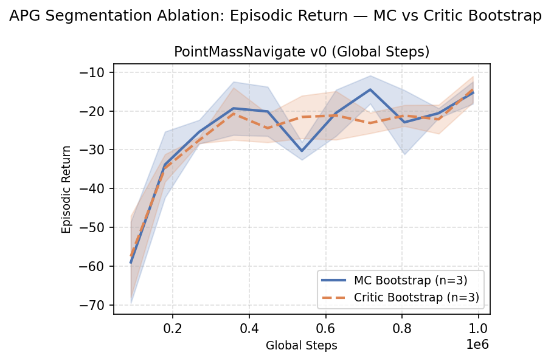
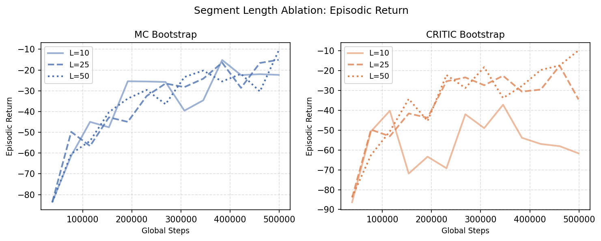

# Analytic Policy Gradients

<p align="center">
    
</p>


**Backpropagating Through Simulation: Analytic Policy Gradients for Sample and Learning Efficient Differentiable Continuous Control**

> 📄 **Full methodology, results, and analysis:** See the [report](https://arxiv.org/pdf/2606.21525)

---

## Motivation

Model-free reinforcement learning algorithms like PPO treat the environment as a black box, estimating policy gradients from sampled rewards. This demands millions of interactions and relies on high-variance advantage estimates, making it prohibitively expensive for real-world deployment.

A largely underexploited opportunity is that many modern simulators are **inherently differentiable** — physics engines, rendering pipelines, and procedural task generators routinely expose analytic derivatives. When environment dynamics are differentiable, the return becomes an end-to-end differentiable function of the policy parameters, enabling **exact gradient computation via backpropagation through the dynamics**. This eliminates the need for advantage estimation, importance sampling, or entropy regularization.

This project implements **Analytic Policy Gradients (APG)** and compares it against PPO across four continuous control tasks of increasing dynamical complexity, using a multi-axis evaluation protocol to decouple sample efficiency from compute efficiency.

## Features

- **Unified training loop** — single entry point (`rl.py`) supports both PPO and APG with a pluggable environment registry
- **PPO** — works out of the box with any Gymnasium environment via automatic wrapping
- **APG** — backpropagates through differentiable environments for exact policy gradients
- **4 custom environments** — from simple 1D point-mass to 7-DOF robot arm, each with both PPO (black-box) and APG (differentiable) variants
- **Segmented backpropagation** — mitigates gradient degradation on long-horizon tasks with MC and critic-based bootstrap modes
- **Multi-seed sweeps** with deterministic evaluation
- **Multi-axis logging** — by environment steps, gradient steps, and wall time for fair comparison
- **Weights & Biases** integration for experiment tracking

## Installation

```bash
git clone https://github.com/yuecideng/analytic_policy_gradients.git
cd analytic_policy_gradients
pip install -r requirements.txt
```

## Quick Start

```bash
# PPO on a continuous gymnasium env
python rl.py --algorithm ppo --env_id PointMassNavigate-v0


# APG on a differentiable environment
python rl.py --algorithm apg --env_id PointMassNavigate-v0
python rl.py --algorithm apg --env_id PushT-v0
python rl.py --algorithm apg --env_id FrankaReach-v0

# Multi-seed sweep with evaluation
python rl.py --algorithm apg --env_id PointMassNavigate-v0 --num_seeds 5 --eval_freq 10

# Equalize total gradient steps between PPO and APG for fair comparison
python rl.py --algorithm apg --env_id PointMassNavigate-v0 --equalize_grad_steps

# With Weights & Biases tracking
python rl.py --algorithm apg --env_id PointMassNavigate-v0 --track
```

CLI arguments use [tyro](https://github.com/brentyi/tyro) — both `--key value` and legacy `key value` styles are supported. All hyperparameters live in the `Args` dataclass in `algo/args.py`.

## Hyperparameters

### Shared

| Parameter | Default | Description |
|-----------|---------|-------------|
| `--learning_rate` | `2.5e-4` | Optimizer learning rate |
| `--anneal_lr` | `True` | Linear learning rate annealing over training |
| `--gamma` | `0.99` | Discount factor |
| `--num_minibatches` | `4` | Number of mini-batches |
| `--update_epochs` | `4` | Number of epochs to update the policy per iteration |
| `--max_grad_norm` | `0.5` | Maximum norm for gradient clipping |
| `--total_timesteps` | `500000` | Total environment timesteps |
| `--num_envs` | `4` | Number of parallel environments |
| `--max_episode_steps` | `30` | Max steps per episode (custom envs) |

### PPO-specific

| Parameter | Default | Description |
|-----------|---------|-------------|
| `--num_steps` | `128` | Steps per environment per rollout |
| `--gae_lambda` | `0.95` | GAE lambda for advantage estimation |
| `--norm_adv` | `True` | Normalize advantages |
| `--clip_coef` | `0.2` | PPO surrogate clipping coefficient |
| `--clip_vloss` | `True` | Use clipped value loss |
| `--ent_coef` | `0.01` | Entropy bonus coefficient |
| `--vf_coef` | `0.5` | Value function loss coefficient |
| `--target_kl` | `None` | Target KL divergence threshold (disables early stopping if `None`) |

### APG-specific

| Parameter | Default | Description |
|-----------|---------|-------------|
| `--apg_num_grad_steps` | `8` | Gradient steps per iteration |
| `--apg_ent_coef` | `0.0` | Entropy bonus coefficient (0 = disabled) |
| `--apg_segment_length` | `0` | Segment length for segmented backprop (0 = full episode) |
| `--apg_bootstrap` | `"critic"` | Bootstrap mode: `"mc"` or `"critic"` |
| `--apg_critic_coef` | `0.5` | Critic loss coefficient (segmented APG only) |
| `--apg_critic_lr` | `None` | Separate critic learning rate (`None` = use `learning_rate`) |
| `--equalize_grad_steps` | `False` | Scale APG iterations to match PPO total gradient steps |

## Environments

| Environment | ID | Domain | Key Dependency |
|---|---|---|---|
| Point Mass (Simple) | `PointMassSimple-v0` | 1D point-mass reaching | Pure PyTorch |
| Point Mass Navigate | `PointMassNavigate-v0` | 2D point-mass with obstacles | Pure PyTorch |
| PushT | `PushT-v0` | 2D rigid-body T-block pushing | Pure PyTorch |
| Franka Reach | `FrankaReach-v0` | 7-DOF robot arm reaching | Warp + Newton Physics |

Each environment provides both a **VecEnv** (black-box PPO) and **APGEnv** (differentiable APG) variant.

## Project Structure

```
.
├── rl.py                        # Backward-compatible entry point (thin wrapper)
├── utils.py                     # Seed setting and utilities
├── pyproject.toml               # Project metadata and dependencies
├── requirements.txt
│
├── algo/                         # Core training package
│   ├── __init__.py              # Version and public API re-exports
│   ├── __main__.py              # CLI entry point (python -m algo)
│   ├── args.py                  # Args dataclass and CLI normalization
│   ├── agent.py                 # Agent, RunningObsNormalizer, layer_init
│   ├── env_utils.py             # make_env, make_custom_vec_env, _create_eval_envs
│   ├── evaluate.py              # deterministic_eval
│   ├── ppo.py                   # PPO training loop
│   ├── apg.py                   # APG training loop
│   └── train.py                 # _run_training orchestrator
│
├── envs/                        # Environment implementations
│   ├── __init__.py              # Re-exports get_env_spec, IMPLEMENTED_ENVS
│   ├── env_registry.py          # Pluggable environment factory
│   ├── torch_wrapper_env.py     # Gymnasium (numpy) → PyTorch bridge
│   ├── point_mass_simple_env.py # 1D point-mass reaching
│   ├── point_mass_env.py        # 2D point-mass with obstacles
│   ├── push_t_env.py            # 2D rigid-body T-block pushing
│   └── franka_reach_env.py      # 7-DOF Franka reaching (Warp + Newton)
│
├── scripts/                     # Plotting and analysis scripts
│   ├── fetch_results.py
│   ├── plot_return_curves.py
│   ├── plot_bootstrap_ablation.py
│   └── plot_segment_ablation.py
├── figures/                     # Generated experiment figures
├── report/                      # LaTeX report source
└── slides/                      # Presentation slides
```

## Architecture

```


rl.py
 ├── make_custom_vec_env()  ──→  env_registry.get_env_spec(env_id)
 │                                    │
 │                            EnvSpec factory (PPO or APG)
 │
 ├── PPO loop:
 │      policy (sample action, no grad) → env.step() → buffer → surrogate loss
 │
 └── APG loop:
    differentiable policy (action with grad) → env.step() → discounted return → loss.backward()  (full gradient flow)
```

- **PPO** treats the env as a black box. Works with any Gymnasium env via `TorchWrapperEnv`.
- **APG** requires a fully differentiable env. Gradients flow from the loss through the return, the reward, the environment dynamics, and back into the policy network.

## Adding a Custom Environment

### For PPO (Black-Box Env)

Any standard [Gymnasium](https://gymnasium.farama.org/) environment works automatically — it is wrapped by `TorchWrapperEnv` at runtime. No registration needed.

### For APG (Differentiable Env)

APG backpropagates through the environment dynamics, so your env must be written entirely in PyTorch (or provide a gradient bridge). Your env class must implement:

```python
class MyAPGEnv:
    # Required attributes
    single_observation_space: gym.spaces.Box
    single_action_space:      gym.spaces.Box
    num_envs: int

    def reset(self, *, seed=None, options=None):
        """Return (obs: Tensor[float], info: dict).
        obs shape: [num_envs, *obs_shape]"""
        ...

    def step(self, action: torch.Tensor):
        """Return (obs, reward, terminated, truncated, info).
        All tensors must preserve the computation graph so that
        loss.backward() can flow gradients back through the dynamics."""
        ...

    def close(self):
        ...
```

Key difference from a standard Gymnasium env: **tensors returned by `step()` must carry `grad_fn`** so that the policy gradient can flow through the environment transition.

### Registering Your Environment

Add your env to `IMPLEMENTED_ENVS` in `env_registry.py`:

```python
from my_env import MyVecEnv, MyAPGEnv

IMPLEMENTED_ENVS["MyEnv-v0"] = EnvSpec(
    ppo_factory=lambda **kw: MyVecEnv(**kw),
    apg_factory=lambda **kw: MyAPGEnv(**kw),   # set to None if not differentiable
)
```

The factory receives these keyword arguments from `rl.py`:

| Argument | Type | Description |
|---|---|---|
| `num_envs` | `int` | Number of parallel environments |
| `device` | `str` | `"cpu"` for PPO, e.g. `"cuda"` for APG |
| `headless` | `bool` | Suppress viewer windows |


## Results


The following figures show APG vs PPO comparison across environments, along with ablation studies on bootstrap strategy and segment length.

| Point Mass | PushT | Franka Reach |
|---|---|---|
|  |  |  |

**Return Curves (APG vs PPO, equalized gradient steps):**

| Point Mass Navigate | PushT | Franka Reach |
|---|---|---|
|  |  |  |

| Bootstrap Ablation | Segment Length Ablation |
|---|---|
|  |  |

> Full results and analysis are available in the [report](https://arxiv.org/pdf/2606.21525).

## Citation

If you find this work useful, please cite:

```bibtex
@misc{deng2026backpropagatingsimulationanalyticpolicy,
      title={Backpropagating Through Simulation: Analytic Policy Gradients for Sample and Learning Efficient Differentiable Continuous Control}, 
      author={Yueci Deng},
      year={2026},
      eprint={2606.21525},
      archivePrefix={arXiv},
      primaryClass={cs.LG},
      url={https://arxiv.org/abs/2606.21525}, 
}
```

## License

This project is licensed under the [MIT License](LICENSE).
